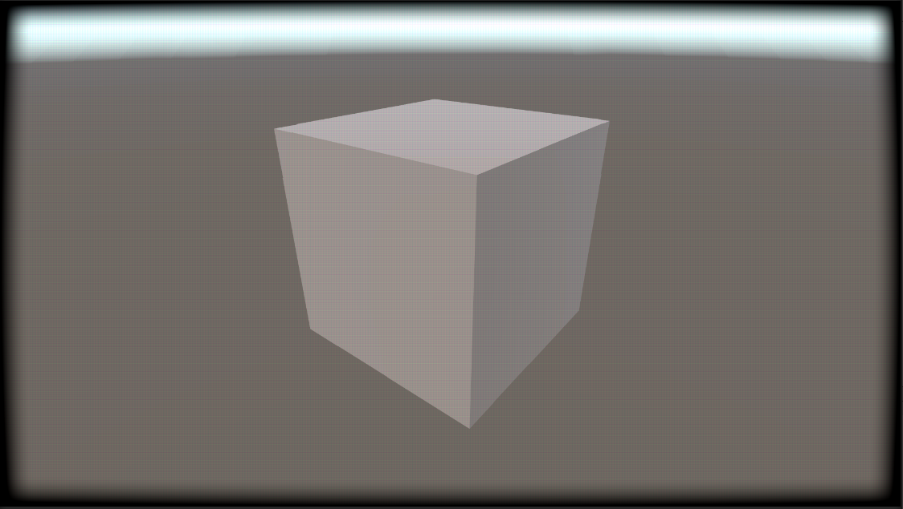
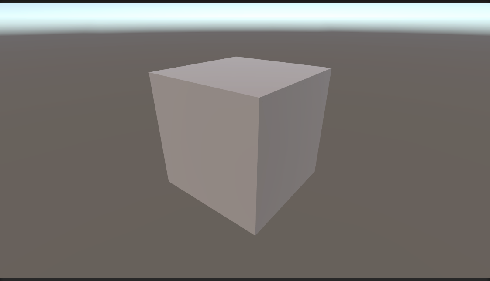

# Unity URP CRT Shader Effect

|  |  |
|:------------------------:|:----------------------------:|
| With effect             | Without effect               |

## Disclaimer
This project is purely for personal study purposes. I am not an expert in shaders, and this is a learning experience for me, so feel free to reach out for any advice.

## Overview
This repository contains a Unity URP project featuring a full-screen CRT shader effect created using Shader Graph. The project includes an example scene with the CRT effect enabled. 

To enable or disable the CRT effect, you will need to modify the `URP-HighFidelity-Renderer` object located in the `Settings` folder. In the Inspector, you can toggle the component in the Renderer Features section.

This effect was developed using Unity version **2022.3.34f1** with the Universal Render Pipeline (URP) and Shader Graph.

## Credits
The shader effect is inspired by a video from the YouTuber **Acerola**. You can check out the video here: [Acerola's CRT Shader Tutorial](https://www.youtube.com/watch?v=aWdySZ0BtJs).

Special thanks to the creators of **Loop Hero**, developed by **Four Quarters** and published by **Devolver Digital**. You can find more information about the game on their Steam page: [Loop Hero on Steam](https://store.steampowered.com/app/1282730/Loop_Hero/).

Feel free to use this project freely for your own learning or projects!

## Contact
If you have any questions or need further assistance, please feel free to contact me at **info@modestogames.it**.

